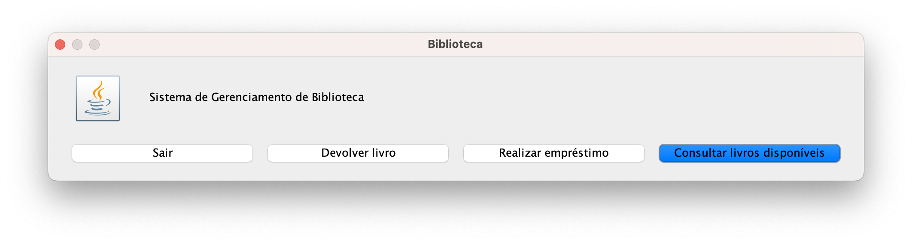
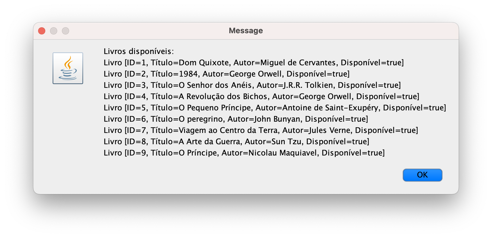
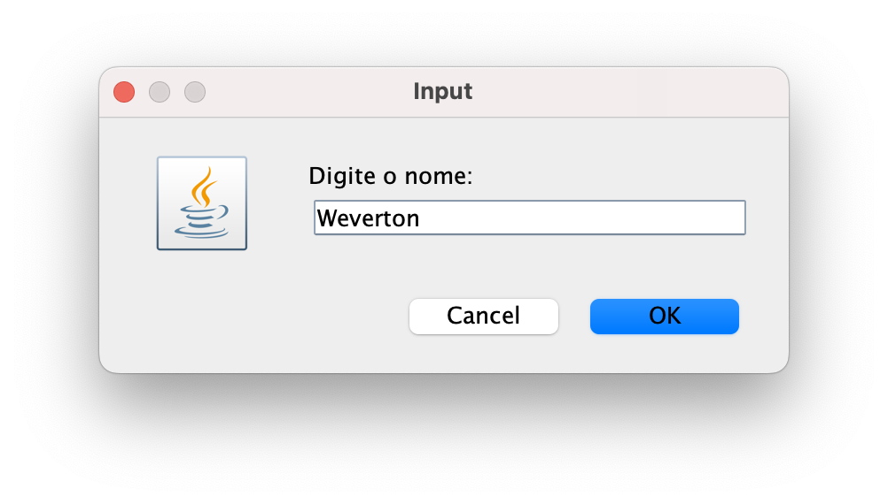
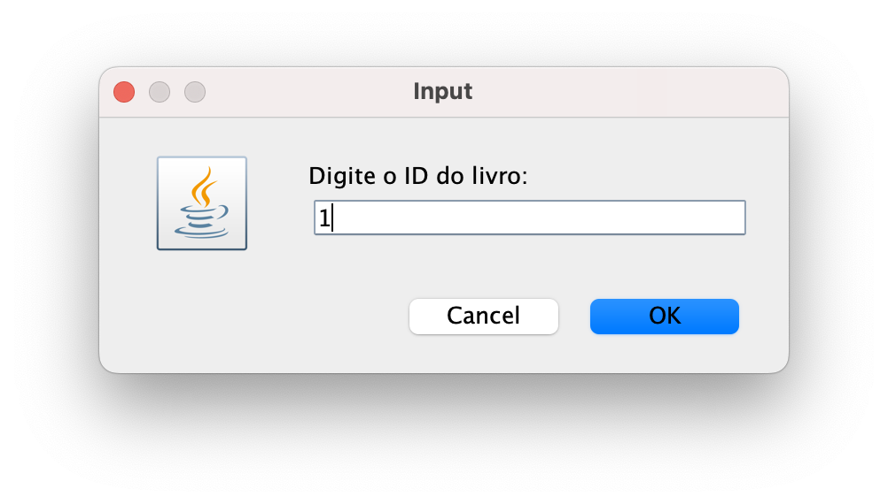
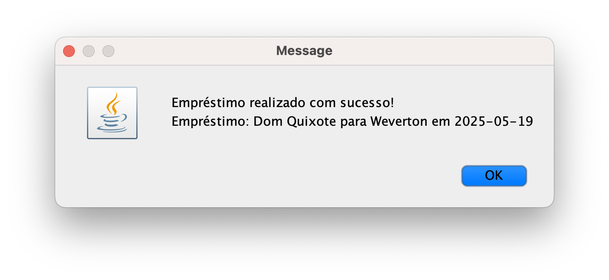
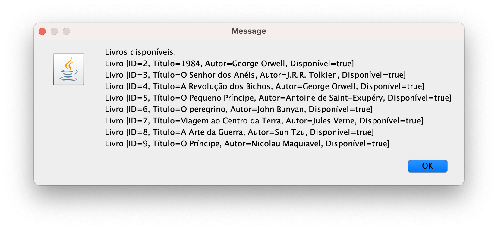
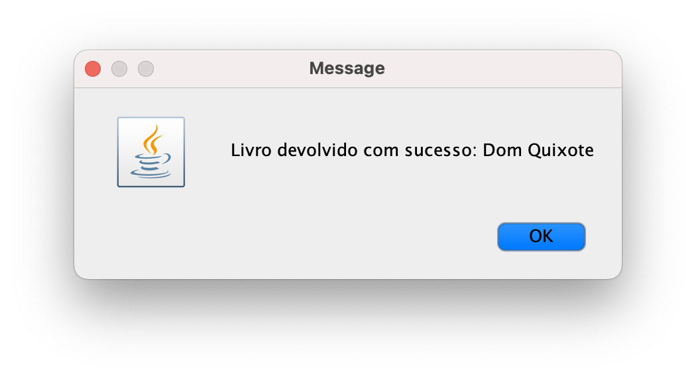

## Sistema de Gerenciamento de Biblioteca

Este projeto é um sistema simples de gerenciamento de biblioteca, feito em Java com Programação Orientada a Objetos (POO). Ele permite consultar livros disponíveis, realizar empréstimos e devolver livros, interface feita com JOptionPane.

### Estrutura do Sistema

1. Classe Livro

Propósito: Gerencia as informações de um livro e seu status (disponível ou emprestado).
Atributos:
id (int, final): Identificador único.
titulo (String, final): Título do livro.
autor (String, final): Nome do autor.
disponivel (boolean): Indica se o livro está ou não disponível.

Métodos:
emprestar(): Marca o livro como indisponível.
devolver(): Marca o livro como disponível.
getId(), getTitulo(), getAutor(), isDisponivel(): Acessam os atributos da classe.
toString(): Exibe os dados do livro.

2. Classe Usuario

Propósito: Representa uma pessoa que pega livros emprestados, armazenando na memória seus dados e lista de livros.
Atributos:
cpf (String, final): CPF do usuário.
nome (String, final): Nome do usuário.
livrosEmprestados (List, final): Lista de livros emprestados.

Métodos:
pegarEmprestado(Livro): Adiciona um livro à lista e o marca como emprestado.
devolverLivro(Livro): Remove o livro da lista e o marca como disponível.
getCpf(), getNome(), getLivrosEmprestados(): Acessam os atributos da classe.
toString(): Exibe os dados do usuário.

3. Classe Emprestimo

Propósito: Registra um empréstimo, associa um livro a um usuário.
Atributos:
livro (Livro, final): Livro emprestado.
usuario (Usuario, final): Usuário que pegou o livro.
dataEmprestimo (LocalDate, final): Data do empréstimo.

Métodos:
getDetalhes(): Retorna uma descrição do empréstimo.
Construtor: Associa o livro ao usuário e registra o empréstimo.

### Relacionamentos

Associação: Usuario e Livro são associados via Emprestimo. Um usuário pode ter vários livros emprestados (1:N), e um livro pode ser emprestado a um usuário por vez.
Composição: Emprestimo depende de Livro e Usuario, pois só existe com essas instâncias.
Herança: Não utilizada, já que as classes não têm hierarquia natural.


### Princípios de POO Aplicados

**Encapsulamento**:

Atributos são `private` (ou `private final`), acessados apenas por getters ou métodos específicos, como `emprestar()` e `devolver()` em `Livro`, ou `pegarEmprestado()` em `Usuario`. Isso protege os dados e garante que as regras sejam seguidas (por ex. verificar disponibilidade).

**Herança**:

Implementamos a classe abstrata `ItemBiblioteca`, que define atributos (`id`, `disponivel`) e métodos (`emprestar()`, `devolver()`) comuns a todos os itens da biblioteca. A classe `Livro` herda de `ItemBiblioteca`, adicionando atributos específicos (`titulo`, `autor`) e implementando `toString()`. Isso permite reutilizar código e facilita a adição de novos tipos de itens, como revistas, no futuro.

**Polimorfismo**:

O método `toString()` é sobrescrito em `Livro` e `Usuario` para exibir informações específicas. Na classe `Main`, `getDetalhes()` de `Emprestimo` usa esses métodos para mostrar dados de forma consistente, permitindo flexibilidade na exibição.

**Abstração**:

As classes abstraem entidades reais: `Livro` foca em título, autor e disponibilidade; `Usuario` em CPF, nome e livros emprestados; `Emprestimo` em livro, usuário e data. A interface com `JOptionPane` simplifica a interação, escondendo a lógica interna.


### Como Executar

Navegue até o diretório do projeto:

```
cd ~/LibrarySystem
```

Compile o código:

```
javac -d bin src/*.java src/model/*.java
```

Execute:

```
java -cp bin Main
```

### Fluxo de Uso do Sistema

Tela inicial: O sistema exibe um menu com opções para consultar livros, realizar empréstimo, devolver livro ou sair.



Consultar livros disponíveis: Mostra a lista de livros disponíveis para empréstimo.



Realizar empréstimo - Inserir CPF: O usuário informa o CPF para o empréstimo.


Realizar empréstimo - Inserir nome: O usuário informa o nome.



Realizar empréstimo - Inserir ID do livro: O usuário seleciona o livro pelo ID.



Confirmação do empréstimo: O sistema confirma o empréstimo com os detalhes.
˝


Lista atualizada após empréstimo: A consulta de livros disponíveis reflete que o livro emprestado não aparece mais.



Devolver livro: Após informar CPF e ID do livro, o sistema confirma a devolução.


